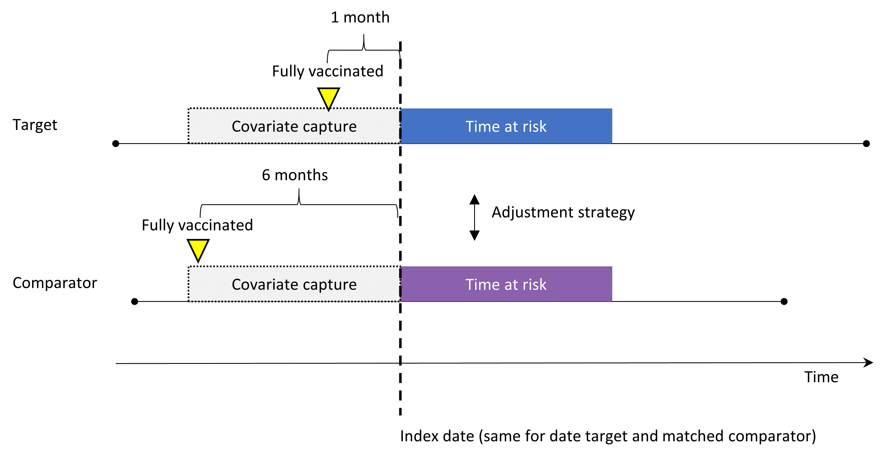
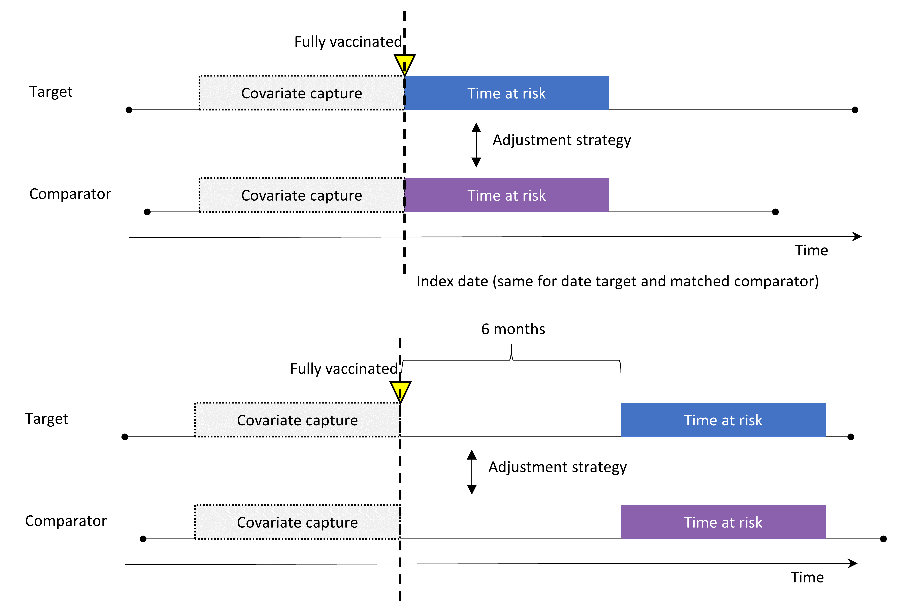
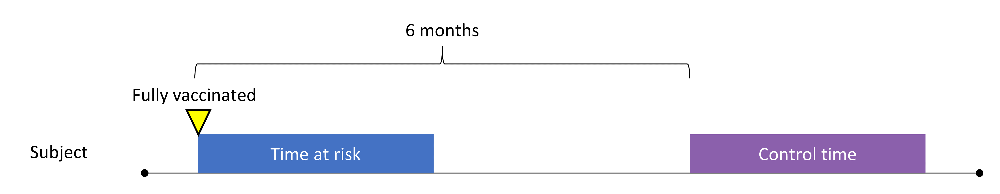

```{r setup, include=FALSE}
knitr::opts_chunk$set(echo = TRUE)
options(kableExtra.latex.load_packages = FALSE)
library(kableExtra)
#knitr::knit_hooks$set(document = function(x) {sub('\\usepackage[]{color}', '\\usepackage[table]{xcolor}', x, fixed = TRUE)})
library(dplyr)
options(knitr.kable.NA = "")
if (!knitr::is_latex_output() && !knitr::is_html_output()) {
  options(knitr.table.format = "simple")
}

pdf2png <- function(path) {
  # only do the conversion for non-LaTeX output
  if (knitr::is_latex_output()) {
    return(path)
  }
  path2 <- xfun::with_ext(path, "png")
  img <- magick::image_read_pdf(path)
  magick::image_write(img, path2, format = "png")
  path2
}


latex_table_font_size <- 8

source("PrintCohortDefinitions.R")

numberOfNcs <- nrow(readr::read_csv("../inst/settings/NegativeControlOutcomes.csv", col_types = readr::cols()))

```

# List of Abbreviations

```{r abbreviations, echo=FALSE, results="asis", warning=FALSE, message=FALSE}
abbreviations <- readr::read_delim(col_names = FALSE, delim = ";", trim_ws = TRUE, file = "
  AUC; Area Under the receiver-operator Curve 
  CCAE; IBM MarketScan Commercial Claims and Encounters 
  CDM; Common Data Model
  CIOMS; Council for International Organizations of Medical Sciences
  COVID-19; COronaVIrus Disease 2019
  CPRD; Clinical Practice Research Datalink
  CRAN; Comprehensive R Archive Network
  EHR; Electronic Health Record
  EMA; European Medicines Agency
  ENCEPP; European Network of Centres for Pharmacoepidemiology and Pharmacovigilance
  H1N1pdm; Hemagglutinin Type 1 and Neuraminidase Type 1 (2009 pandemic influenza)
  HPV; Human PapillomaVirus
  IRB; Institutional review board
  JMDC; Japan Medical Data Center
  LLR; Log Likelihood Ratio
  MDCR; IBM MarketScan Medicare Supplemental Database
  MDCD; IBM MarketScan Multi-State Medicaid Database 
  MSE; Mean Squared Error
  OHDSI; Observational Health Data Science and Informatics
  OMOP; Observational Medical Outcomes Partnership
  MaxSPRT; MAXimized Sequential Probability Ratio Test 
  PS; Propensity score
  RCT; Randomized controlled trial
  SCCS; Self-Controlled Case Series
  SCRI; Self-Controlled Risk Interval
  WHO; World Health Organization
")

tab <- kable(abbreviations, col.names = NULL, linesep = "", booktabs = TRUE)

if (knitr::is_latex_output()) {
  tab %>% kable_styling(latex_options = "striped", font_size = latex_table_font_size)
} else {
  tab %>% kable_styling(bootstrap_options = "striped")
} 
```

# Responsible Parties

## Investigators

```{r parties, echo=FALSE, results="asis", warning=FALSE, message=FALSE}
parties <- readr::read_delim(col_names = TRUE, delim = ";", trim_ws = TRUE, file = "
  Investigator; Institution/Affiliation
  Thamir M Alshammari; College of Pharmacy, Riyadh Elm University, Riyadh, Saudi Arabia  
  George Hripcsak; Department of Biomedical Informatics, Columbia University, New York, NY, USA
  Nicole Pratt ; Quality Use of Medicines and Pharmacy Research Centre, University of South Australia   
  Dani Prieto-Alhambra; Centre for Statistics in Medicine, NDORMS, University of Oxford, Oxford, UK
  Patrick B. Ryan; Observational Health Data Analytics, Janssen Research and Development, Titusville, NJ, USA
  Martijn J. Schuemie *; Observational Health Data Analytics, Janssen Research and Development, Titusville, NJ, USA
  Marc A. Suchard; Department of Biostatistics, University of California, Los Angeles, Los Angeles, CA, USA
")

tab <- kable(parties, booktabs = TRUE, linesep = "") %>% 
  column_spec(1, width = "10em") %>%
  column_spec(2, width = "30em") %>%
  footnote(general = "* Principal Investigator", general_title = "")

if (knitr::is_latex_output()) {
  tab %>% kable_styling(latex_options = "striped", font_size = latex_table_font_size)
} else {
  tab %>% kable_styling(bootstrap_options = "striped")
}
```

## Disclosures

This study is undertaken within Observational Health Data Sciences and Informatics (OHDSI), an open collaboration.
**GH** receives grant funding from the US National Institutes of Health and the US Food & Drug Administration.
**PBR** and **MJS** are employees of Janssen Research and Development and shareholders in John & Johnson.
**DPA** reports grants and other from Amgen, grants, non-financial support and other from UCB Biopharma, grants from Les Laboratoires Servier,  outside the submitted work;  and Janssen, on behalf of IMI-funded EHDEN and EMIF consortiums, and Synapse Management Partners have supported training programmes organised by DPA's department and open for external participants.
**MAS** receives grant funding from the US National Institutes of Health and the US Food & Drug Administration and contracts from the US Department of Veterans Affairs and Janssen Research and Development.

# Abstract

**Background and Significance**


**Study Aims**


**Study Description**


# Milestones

Table \@ref(tab:dates) lists the study milestones.

```{r dates, echo=FALSE, results="asis", warning=FALSE, message=FALSE}
dates <- readr::read_delim(col_names = TRUE, delim = ";", trim_ws = TRUE, file = "
  Milestone; Planned / actual date
  EU PAS Registration;2021-03-23
  Start of analysis;2021-03-23
  End of analysis;2021-05-01
  Results presentation;2021-05-01
")

tab <- kable(dates, booktabs = TRUE, linesep = "", caption = "Study milestones") 

if (knitr::is_latex_output()) {
  tab %>% kable_styling(latex_options = "striped", font_size = latex_table_font_size)
} else {
  tab %>% kable_styling(bootstrap_options = "striped")
}
```

# Rationale and Background

# Study Objectives

# Research Methods

## Exposure-outcome pairs

### Exposures


### Negative control exposures 

The full list of negative control exposures can be found in Appendix \@ref(negative-control-exposures)

Negative control outcomes are defined as the first occurrence of the negative control concept or any of its descendants. 

### Negative control outcomes 

The full list of negative control outcomes can be found in Appendix \@ref(negative-control-outcomes)

Negative control outcomes are defined as the first occurrence of the negative control concept or any of its descendants. 

### Imputed positive control outcomes 

Positive controls are outcomes known to be caused by vaccines, and ideally would be detected as signals by a safety surveillance system as early as possible.
For various reasons, real positive controls are problematic.[@Schuemie2018-zi] 
Instead, here we will rely on imputed positive controls, created by shifting the estimated effect sizes for the negative controls. 
We assume the negative controls have a true effect size of 1, so to simulate the estimated effect size when the true effect size is $\theta$ we multiply the estimate by $\theta$. 
For example, if for a negative control a method produces an effect size estimate of 1.1, for a positive control with true effect size of 2 the estimated effect size becomes 1.1 x 2 = 2.2. 
This approach makes strong assumptions on the nature of the systematic error, most importantly that systematic error does not change as a function of the true effect size. 
Although this assumption is likely not to hold in the real world, imputing positive controls allows us to provide some indication of what type 2 error to expect for various true effect sizes. 
For each negative control we will impute positive controls with true effect sizes of 1.5, 2, and 4, so using the `r numberOfNcs` negative controls we are able to construct `r numberOfNcs` $\times$ 3 = `r numberOfNcs*3` positive control outcomes.
This increased true effect is applied both for the first and second injection of multi-dose vaccines.

## Data sources


## Methods to evaluate

```{r cm1, fig.cap='Cohort method design 1',echo=FALSE, out.width='90%', fig.align='center', fig.pos='h'}

```

```{r cm2, fig.cap='Cohort method design 2',echo=FALSE, out.width='90%', fig.align='center', fig.pos='h'}

```
```{r sccs, fig.cap='SCCS design',echo=FALSE, out.width='90%', fig.align='center', fig.pos='h'}

```


## Metrics


## Overview of analyses


# Strengths and Limitations

## Strengths

 
## Limitations
 

# Protection of Human Subjects

MEDON does not involve human subjects research.
The project does, however, use de-identified human data collected during routine healthcare provision.
All data partners executing the MEDON studies within their data sources will have received institutional review board (IRB) approval or waiver for participation in accordance to their institutional governance prior to execution (see Table \@ref(tab:irb)).
MEDON executes across a federated and distributed data network, where analysis code is sent to participating data partners and only aggregate summary statistics are returned, with no sharing of patient-level data between organizations.

```{r irb, echo=FALSE,warning=FALSE, message=FALSE}
data_sources <- readr::read_delim(col_names = TRUE, delim = "&", trim_ws = TRUE, file = "
Data source & Statement
IBM MarketScan Commercial Claims and Encounters (CCAE) & New England Institutional Review Board and was determined to be exempt from broad IRB approval, as this research project did not involve human subject research.
IBM MarketScan Medicare Supplemental Database (MDCR)  & New England Institutional Review Board and was determined to be exempt from broad IRB approval, as this research project did not involve human subject research.
IBM MarketScan Multi-State Medicaid Database (MDCD) & New England Institutional Review Board and was determined to be exempt from broad IRB approval, as this research project did not involve human subject research.
Japan Medical Data Center (JMDC) & New England Institutional Review Board and was determined to be exempt from broad IRB approval, as this research project did not involve human subject research.
Optum Clinformatics Data Mart (Optum) & New England Institutional Review Board and was determined to be exempt from broad IRB approval, as this research project did not involve human subject research.
Optum Electronic Health Records (OptumEHR) & New England Institutional Review Board and was determined to be exempt from broad IRB approval, as this research project did not involve human subject research.
Clinical Practice Research Datalink (CPRD) GOLD & Independent Scientific Advisory Committee will review the protocol prior to study execution.
")

tab <- kable(data_sources, booktabs = TRUE, linesep = "",
      caption = "IRB approval or waiver statement from partners.") %>% 
  kable_styling(bootstrap_options = "striped", latex_options = "striped")

if (knitr::is_latex_output()) {
  tab %>%
    column_spec(1, width = "15em") %>%
    column_spec(2, width = "40em") %>%
    kable_styling(font_size = latex_table_font_size)
} else {
  tab
}
```

# Management and Reporting of Adverse Events and Adverse Reactions

MEDON uses coded data that already exist in electronic databases.
In these types of databases, it is not possible to link (i.e., identify a potential causal association between) a particular product and medical event for any specific individual.
Thus, the minimum criteria for reporting an adverse event (i.e., identifiable patient, identifiable reporter, a suspect product and event) are not available and adverse events are not reportable as individual adverse event reports.
The study results will be assessed for medically important findings.

# Plans for Disseminating and Communicating Study Results

Open science aims to make scientific research, including its data process and software, and its dissemination, through publication and presentation, accessible to all levels of an inquiring society, amateur or professional [@Woelfle2011-ss] and is a governing principle of MEDON.
Open science delivers reproducible, transparent and reliable evidence.
All aspects of MEDON (except private patient data) will be open and we will actively encourage other interested researchers, clinicians and patients to participate.
This differs fundamentally from traditional studies that rarely open their analytic tools or share all result artifacts, and inform the community about hard-to-verify conclusions at completion.

## Transparent and re-usable research tools

We will publicly register this protocol and announce its availability for feedback from stakeholders, the OHDSI community and within clinical professional societies.
This protocol will link to open source code for all steps to generating diagnostics, effect estimates, figures and tables.
Such transparency is possible because we will construct our studies on top of the OHDSI toolstack of open source software tools that are community developed and rigorously tested [@Schuemie2020-wx].
We will publicly host MEDON source code at (https://github.com/ohdsi-studies/MEDON), allowing public contribution and review, and free re-use for anyone’s future research.

## Continous sharing of results

MEDON embodies a new approach to generating evidence from healthcare data that overcome weaknesses in the current process of answering and publishing (or not) one question at a time.
Generating evidence for thousands of research and control questions using a systematic process enables us to not only evaluate that process and the coherence and consistency of the evidence, but also to avoid $p$-hacking and publication bias [@Schuemie2018-zi].
We will store and openly communicate all of these results as they become available using a user-friendly web-based app that serves up all descriptive statistics, study diagnostics and effect estimates for each cohort comparison and outcome.
Open access to this app will be through a general public facing MEDON web-page.

## Scientific meetings and publications

We will deliver multiple presentations at scientific venues and will also prepare multiple scientific publications for clinical, informatics and statistical journals.

## General public

We believe in sharing our findings that will guide clinical care with the general public.
MEDON will use social-media (Twitter) to facilitate this.
With dedicated support from the OHDSI communications specialist, we will deliver regular press releases at key project stages, distributed via the extensive media networks of UCLA and Columbia.

# References {-}

<div id="refs"></div>

# (APPENDIX) Appendix {-}

# Exposure Cohort Definitions


# Negative control exposures

```{r nces, echo=FALSE, warning=FALSE}
ncs <- readr::read_csv("../inst/settings/NegativeControlExposures.csv", col_types = readr::cols())
colnames(ncs) <- SqlRender::camelCaseToTitleCase(colnames(ncs))

tab <- kable(ncs, booktabs = TRUE, linesep = "",
      caption = "Negative control outcomes.", longtable = TRUE) %>% 
  kable_styling(bootstrap_options = "striped", latex_options = "striped")

if (knitr::is_latex_output()) {
  tab %>%
    column_spec(1, width = "15em") %>%
    column_spec(2, width = "40em") %>%
    kable_styling(font_size = latex_table_font_size)
} else {
  tab
}
```

# Negative control outcomes

```{r ncos, echo=FALSE, warning=FALSE}
ncs <- readr::read_csv("../inst/settings/NegativeControlOutcomes.csv", col_types = readr::cols())
colnames(ncs) <- SqlRender::camelCaseToTitleCase(colnames(ncs))

tab <- kable(ncs, booktabs = TRUE, linesep = "",
      caption = "Negative control outcomes.", longtable = TRUE) %>% 
  kable_styling(bootstrap_options = "striped", latex_options = "striped")

if (knitr::is_latex_output()) {
  tab %>%
    column_spec(1, width = "15em") %>%
    column_spec(2, width = "40em") %>%
    kable_styling(font_size = latex_table_font_size)
} else {
  tab
}
```
